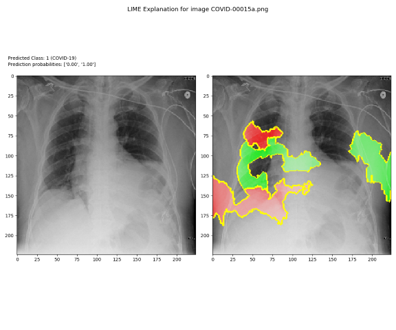
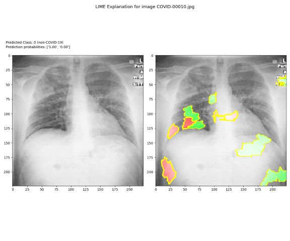
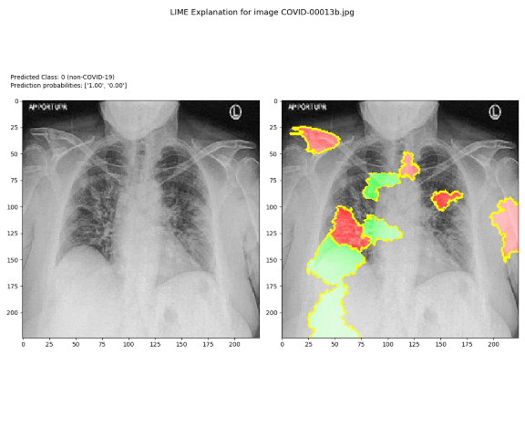

# Explainable COVID-19 Pneumonia Project CS677 Fall 2020

This repo is the second part of the project that is provided in two repos:

1.  https://github.com/cicorias/njit-covid-cxr - this is a duplication of the
    original work to create a trained model -- that model is used in the
    following project

2.  https://github.com/cicorias/njit-deeplearn-explain-shap - this is the second
    part of the project and provides the SHAP visualizations and the project
    writeup.

# Authors

| David Apolinar | Da468\@njit.edu  |
|----------------|------------------|
| Shawn Cicoria  | sc2443\@njit.edu |
| Ted Moore      | tm437\@njit.edu  |

# Overview

For this project, the team explored several papers and implementations of
techniques for providing Explainable machine learning. As articulated in the
paper, and as society becomes more dependent upon AI/ML algorithms for
predictions or making choices in our society, the pressure is there to always be
able to explain "why" an AI/ML model takes a path towards an outcome.

For this project, the team reviewed the existing LIME implementation, then
reviewed the papers:

1.  **A Unified Approach to Interpreting Model Predictions**

~~~~~~~~~~~~~~~~~~~~~~~~~~~~~~~~~~~~~~~~~~~~~~~~~~~~~~~~~~~~~~~~~~~~~~~~~~~~~~~~
@misc{lundberg2017unified,
      title={A Unified Approach to Interpreting Model Predictions}, 
      author={Scott Lundberg and Su-In Lee},
      year={2017},
      eprint={1705.07874},
      archivePrefix={arXiv},
      primaryClass={cs.AI}
}
~~~~~~~~~~~~~~~~~~~~~~~~~~~~~~~~~~~~~~~~~~~~~~~~~~~~~~~~~~~~~~~~~~~~~~~~~~~~~~~~

1.  **AI Explanations Whitepaper** -
    <https://storage.googleapis.com/cloud-ai-whitepapers/AI%20Explainability%20Whitepaper.pdf>

2.  **Interpretable machine learning. A Guide for Making Black Box Models
    Explainable**

~~~~~~~~~~~~~~~~~~~~~~~~~~~~~~~~~~~~~~~~~~~~~~~~~~~~~~~~~~~~~~~~~~~~~~~~~~~~~~~~
@book{molnar2019,
 title      = {Interpretable Machine Learning},
  author     = {Christoph Molnar},
  note       = {\url{https://christophm.github.io/interpretable-ml-book/}},
  year       = {2019},
  subtitle   = {A Guide for Making Black Box Models Explainable}
}
~~~~~~~~~~~~~~~~~~~~~~~~~~~~~~~~~~~~~~~~~~~~~~~~~~~~~~~~~~~~~~~~~~~~~~~~~~~~~~~~

These references provide methods for Explainable machine learning outcomes.
These references provide a detailed explanation of several approaches and all of
them provide Shapley Value (<https://en.wikipedia.org/wiki/Shapley_value>) based
approaches. In addition, Lundberg and Lee present a framework called **SHAP**
(*SHapley Additive exPlanations*) intending to be a unified framework for
interpreting prediction that is used later in this brief.

## Initial LIME implementation Reproduction of Results

In order to rerun and train the model for similar results – you must follow the
initial REPO's instructions for your environment – and modify the
**config.yaml** to match your file system paths, along with using the settings
for training. These steps are clearly explained in the [Getting
Started](https://github.com/aildnont/covid-cxr#getting-started) section here:
<https://github.com/aildnont/covid-cxr#getting-started>

## Team effort and resulting Model

As explained later, but to skip ahead to the SHAP repo, the model used by this
team, that was trained is also located here:
<https://scicoria.blob.core.windows.net/public/model20201115-151427-random-imbalance-NO-fiscore-resnet50v2.h5>

The team cloned all the required repos and followed the setup steps as
articulated in the README.md file located in the Local Interpretable Model
-Agnostic Explanations (LIME).

As in the prior project GPUs are nearly essential for some of the steps.
Leveraging a large GPU enabled virtual machine from Microsoft Azure with the
following configuration:

*Azure Virtual Machine*

-   Standard NC6 (6 vCPUs, 56 GiB memory)

-   1 or 2 NVIDIA Tesla K80 24 GiB of GDDR5 memory

-   Windows (Windows Server 2019 Datacenter)

### Steps taken - Training, validation, and test data

After cloning the primary GitHub repository, we broke the upstream origin remote
and bound it to our own repo at : <https://github.com/cicorias/njit-covid-cxr>.
This was done just to make any of our own modifications to the code easier to
manage through normal git management of source code.

### Dataset configuration

In addition, the supporting data sets were also cloned or pulled locally (Kaggle
data). Each was placed in a relative directory alongside the primary repo under
the RAW_DATA path, and the necessary *config.yaml* file updated with the correct
paths.

### Configuration file

Other than paths, the settings that matter the most for our run are in the
**TRAIN** section, all other settings remained the same as the source
repository.

-   MODEL_DEF : resnet50v2

-   EPOCHS : 100

-   IMB_STRATEGY : random oversample

-   NUM_GPUS: 1

**Model_def** – this setting allows for one of the three supported models in the
original codebase. The resnet50v2 is based upon TensorFlow’s ResNet50V2 with
several layers added for a custom top:

|   | X = GlobalAveragePooling2D()(X)                                                                  |
|---|--------------------------------------------------------------------------------------------------|
|   | X = Dropout(dropout)(X)                                                                          |
|   | X = Dense(nodes_dense0, kernel_initializer='he_uniform', activity_regularizer=l2(l2_lambda))(X)  |
|   | X = LeakyReLU()(X)                                                                               |
|   | X = Dense(n_classes, bias_initializer=output_bias)(X)                                            |
|   | Y = Activation('softmax', dtype='float32', name='output')(X)                                     |

**Epochs** – we set this to 100 to provide training time in a reasonable time
and balance that with the loss output – going from 100 to 200 epochs did not
provide great reduction in loss for this exercise.

**Imb_strategy** – this is the method of how the codebase handled the
significant imbalance of Positive COVID images vs the Negative COVID images. The
code utilizes generators that supplemented the Positive image sets by rotation,
flipping, etc.

**Num_gpus** – the number of GPUs if available the code would use.

### Preprocess data

The corpus of data is split three ways initially and includes generation of data
if the imbalance strategy “random_oversample” is chose.

Two example rows from the generated CSV meta-data files are as follows:

~~~~~~~~~~~~~~~~~~~~~~~~~~~~~~~~~~~~~~~~~~~~~~~~~~~~~~~~~~~~~~~~~~~~~~~~~~~~~~~~
,filename,label,label_str
349,rsna/0700bc73-b6e3-412e-9e2f-aa0b83424804.jpg,0,non-COVID-19
830,rsna/0abbde89-55e8-4b25-ba9b-17a99f84bae0.jpg,0,non-COVID-19
~~~~~~~~~~~~~~~~~~~~~~~~~~~~~~~~~~~~~~~~~~~~~~~~~~~~~~~~~~~~~~~~~~~~~~~~~~~~~~~~

The first column is an index from the originating image dataset and is not used.
The second is the source/image filename from that dataset.

Finally, there is an integer label and text label – where 0 – is “negative” for
COVID, and 1 is “positive” for COVID – a binary classification.

The three CSV files for meta-data created during pre-process:

The breakdown of these files is as follows – with each line in the file
providing a reference to a filename, along with being labeled either COVID or
non-COVID.

### Training Set

| **Row Labels**  | **Count of label_str** |
|-----------------|------------------------|
| COVID-19        | 28                     |
| non-COVID-19    | 1461                   |
| (blank)         |                        |
| **Grand Total** | **1489**               |

### Validation Set

| **Row Labels**  | **Count of label_str** |
|-----------------|------------------------|
| COVID-19        | 3                      |
| non-COVID-19    | 143                    |
| (blank)         |                        |
| **Grand Total** | **146**                |

### Test Set

| **Row Labels**  | **Count of label_str** |
|-----------------|------------------------|
| COVID-19        | 4                      |
| non-COVID-19    | 178                    |
| (blank)         |                        |
| **Grand Total** | **182**                |

We see that the training set consists of 1461 non-COVID and only 28 COVID
positive images. We see similar deficiencies in the datasets for validation and
test as well.

For that significant imbalance, the training process, as documented in the
COVID-cxr repository (https://github.com/aildnont/covid-cxr) the team chose the
option for "random-imbalance", as mentioned before in the configuration section.
This option uses a data generation for Training of images until each class (in
our case just binary two classes) are of equal number of samples. So, from 28
Training set images 1433 images are created through additional random picking of
the 28 -- this is in the original source code as
**train.py(random_minority_oversample)** method**.** This relies on a method
called **RandomOverSampler** from the **imbalanced-learn-API** package
(https://imbalanced-learn.readthedocs.io/en/stable/generated/imblearn.over_sampling.RandomOverSampler.html).

The unfortunate thing is that this could be further improved via image rotation,
flipping instead of just "over-sampling" of the 28 images as this is nearly
duplication of every image N times until it reaches 1433 as the ratio is so
small. This would be an area of great improvement in building greater trust in
the model itself. The other option is to stick with **class_weights** – which
just sticks with the imbalance, but as the original authors documented, this is
a trade-off that resulted in lower accuracies from training and left for further
experimentation.

During our training runs, since model turning and perfection was not the focus,
and the training accuracy, loss was quite similar between **class_weights** and
**random_imbalance**, we stuck with the latter option. As we see later, the
choice was adequate for expanding into both the LIME and SHAP explainable
techniques.

### Training run output

Mostly expected with the random oversampling, there is quite a bit of
overfitting. Again, the focus of this experiment is on explain-ability not the
performance of this model. The Training/Validation metrics are:

### Training / validation

| train metric      | validation metric         |
|-------------------|---------------------------|
| loss: 0.0180      | val_loss: 0.1581          |
| accuracy: 0.9997  | val_accuracy: 0.9795      |
| precision: 0.9993 | val_precision: 0.0000e+00 |
| recall: 1.0000    | val_recall: 0.0000e+00    |
| auc: 1.0000       | val_auc: 0.9762           |

We can see the overfitting clearly, and again this is easily attributed to the
vast imbalance of non-COVID vs COVID x-rays – which further compounded and leads
to overfitting when basic random sampling is such a small pool of images (28)
for COVID to start with and extrapolating to 1489 images.

From Tensorboard the accuracy plotting over epoch.

**NOTE**: Given the inverted articulation of "positive" vs "negative" along with
the imbalance, the confusion matrix and associated metrics may look a bit
awkward.

### Test set results

| loss = 0.13487988989800215 accuracy = 0.9945 precision = 0.0 recall = 0.0 auc = 0.9814938 | confusion matrix: True (-)ves: 181  False (+)ves: 0  False (-)ves: 1  True (+)ves: 0 |
|-------------------------------------------------------------------------------------------|--------------------------------------------------------------------------------------|

### Confusion Matrix

**Test set was reasonable with 1 false negative of the 4 samples presented.**

| **Measure**                                                                      | **Value** | **Derivations**                                             |
|----------------------------------------------------------------------------------|-----------|-------------------------------------------------------------|
| [Sensitivity](https://onlineconfusionmatrix.com/#measures)                       | 0.0000    | TPR = TP / (TP + FN)                                        |
| [Specificity](https://onlineconfusionmatrix.com/#measures)                       | 1.0000    | SPC = TN / (FP + TN)                                        |
| [Precision](https://onlineconfusionmatrix.com/#measures)                         |           | PPV = TP / (TP + FP)                                        |
| [Negative Predictive Value](https://onlineconfusionmatrix.com/#measures)         | 0.9945    | NPV = TN / (TN + FN)                                        |
| [False Positive Rate](https://onlineconfusionmatrix.com/#measures)               | 0.0000    | FPR = FP / (FP + TN)                                        |
| [False Discovery Rate](https://onlineconfusionmatrix.com/#measures)              |           | FDR = FP / (FP + TP)                                        |
| [False Negative Rate](https://onlineconfusionmatrix.com/#measures)               | 1.0000    | FNR = FN / (FN + TP)                                        |
| [Accuracy](https://onlineconfusionmatrix.com/#measures)                          | 0.9945    | ACC = (TP + TN) / (P + N)                                   |
| [F1 Score](https://onlineconfusionmatrix.com/#measures)                          | 0.0000    | F1 = 2TP / (2TP + FP + FN)                                  |
| [Matthews Correlation Coefficient](https://onlineconfusionmatrix.com/#measures)  |           | TP\*TN - FP\*FN / sqrt((TP+FP)\*(TP+FN)\*(TN+FP)\*(TN+FN))  |

## Model output

The resulting model after training is persisted as an H5 file containing model
composition along with trained weights. This H5 model is now portable and usable
for subsequent phases. In addition, for the final SHAP step, the model is pushed
to Azure Cloud Storage at the following location and is approximately 240 MBs in
size. The H5 file format and working with is explained here:
<https://www.tensorflow.org/tutorials/keras/save_and_load>.

Model – trained:
<https://scicoria.blob.core.windows.net/public/model20201115-151427-random-imbalance-NO-fiscore-resnet50v2.h5>

#  LIME Interpretations

For the first part of the project, to recreate the initial results from the
GitHub Repository, after training the model, updating the config.yaml to use
that model, then running the single or batch LIME interpretation we are provided
with some visualizations that help identify the features of the source images
that push the classification to either COVID or non-COVID.

## What is LIME

As explained in the reference paper from the provided GitHub repository, Local
Interpretable Model-Agnostic Explanations (i.e. LIME) can be applied for model
explain-ability, which is what the authors initial provided. LIME groups pixels
from the images together, forming super-pixels that represent the features. The
processes use the contribution (either +/-) to the outcome or predicted class of
these groupings. For this project, the explanations are shown as overlays of
colors for these groupings that are primary contributions. In this
implementation, green represents significant positive contribution towards the
predicted class; red is the inverse.

## LIME with the x-ray dataset

Before running a batch of images, you must first run the script -
.**/src/interpretability/lime_explain.py** – which is hardcoded to choose an
image from the dataset. It then persists two "pickle" files (persisted Python
object) – that is subsequently used by the batch prediction script.

To run a batch of images through, we utilized the provided script -
.**/src/predict.py** which relies on the the **config.yaml** settings below,
which obviously includes our trained model in addition to the pickle files from
above, the source path of x-ray images (BATCH_PRED_IMGS), and where to write the
output.

~~~~~~~~~~~~~~~~~~~~~~~~~~~~~~~~~~~~~~~~~~~~~~~~~~~~~~~~~~~~~~~~~~~~~~~~~~~~~~~~
  MODEL_TO_LOAD: 'results\models\model20201110-073719.h5'
  LIME_EXPLAINER: './data/interpretability/lime_explainer.pkl'
  OUTPUT_CLASS_INDICES: './data/interpretability/output_class_indices.pkl'
  BATCH_PRED_IMGS: 'E:/g/njit/deep-learn/cnn/RAW_DATA/Figure1-COVID-chestxray-dataset/images/'
  BATCH_PREDS: 'results/predictions/'
~~~~~~~~~~~~~~~~~~~~~~~~~~~~~~~~~~~~~~~~~~~~~~~~~~~~~~~~~~~~~~~~~~~~~~~~~~~~~~~~

From the output, we then are going to look at 6 images – 3 that are COVID
(positive) and 3 that are non-COVID (negative) using the output of the LIME
explanation.

# Batch LIME Predictions and Visualizations

All images used in this step are from the GitHub repository of x-ray image data
at <https://github.com/ieee8023/covid-chestxray-dataset>.

The images we chose out of this batch for discussion are below, and all batch
predictions have been added to the GitHub repo at:
<https://github.com/cicorias/njit-covid-cxr/tree/master/results/predictions/20201106-135747>.
Normally these would be excluded from being committed via the .gitignore but for
this write-up we chose to add a run to the online GitHub repository.

## COVID

-   COVID-00001.jpg

-   COVID-00015a.png

-   COVID-00015b.png

## non-COVID

-   COVID-00010.jpg

-   COVID-00013a.jpg

-   COVID-00013b.jpg

# Batch Output COVID positive images

As shown below, each image along with the annotated LIME image are show
alongside each other. For the labeling, the COVID images are all labeled as
"COVID" or positive. The LIME coloring as described before, green pushed the
classification GREATER, while RED lower. The magnitude and overall coverage are
not easily seen, but the visualization certainly aids in helping a human poke
further into the original images to see any features and provide further trust
as that aligns with reality.

## COVID

-   COVID-00001.jpg (positive)

    

-   COVID-00015a.png (positive)

    

-   COVID-00015b.png (positive)

    

# Batch Output non-COVID negative images

These image pairs on all non-COVID. Again, the coloring provided either Green or
Red as it contributes positively or negatively towards classification.

## non-COVID

-   COVID-00010.jpg (negative)

    

    COVID-00013a.jpg (negative)

    

-   COVID-00013b.jpg (negative)

    

# Shapley Value Overview

Before discussing the SHAP Method, it is important to discuss Shapley values,
which the SHAP method relies on. The general idea is to determine how much each
feature contributed to the ultimate prediction of the mode.

## Shapley values and SHAP Overview

As described in Google’s AI and Explainability Whitepaper, SHAPLEY is a concept
from cooperative game theory. This process created by Lloyd Shapley in 1953. The
Shapley approach leverages a concept of Shapley values. Shapley values make it
possible to determine what contributions specific inputs have to a given
outcome.

From the online book - Interpretable Machine Learning [Molnar, Christoph]
Shapley values are defined as follows
[<https://christophm.github.io/interpretable-ml-book/shapley.html>]:

>   *A prediction can be explained by assuming that each feature value of the
>   instance is a "player" in a game where the prediction is the payout. Shapley
>   values -- a method from coalitional game theory -- tells us how to fairly
>   distribute the "payout" among the features.*

To illustrate this further, Google’s AI explainability whitepaper uses a set of
3 employees to measure what contributions each gave to achieve a specific
profit. Assuming we have the profit of outcome of each *collective* combination
of employees (eg. A, B, C, A and B, B and C, etc.) we then determine the
*relative* contribution of each employee by calculating their incremental
contribution in all of the possible permutations of adding employees in sequence
to build to the complete collection of the three employees. The average of these
incremental contributions is known as the Shapley value, and the employee with
the largest Shapley value is considered to have the highest contribution to the
profit.

In our scenario with the Covid-19 dataset, we can apply the Shapley principal to
determine which features contributed the most to a given prediction. Because we
are analyzing images, “features” correspond to pixels and we can calculate the
relative importance of each pixel (or average importance over a cluster of
pixels) to a positive or negative prediction and use it to highlight or draw
bounding boxes around areas of importance.

This visual indication of importance will enable a human-in-the-loop to make
educated decisions about our model, such as figure out whether the the model is
skewed or needs to be updated to correct bias that may be due to limitations in
the available dataset. This also makes it possible for a medical doctor who is
reviewing the results from a model, to determine what the strengths and
weaknesses are, and make suitable changes. This is described in the [Axiomatric
Attribution for Deep Networks](https://arxiv.org/abs/1703.01365) whitepaper.

## SHAP (SHapley Addictive exPlanations)

At a high level, SHAP is considered a process to explain individual predictions.
Christoph M, describes “the goal of SHAP as explaining the prediction of an
instance of x by computing each contribution to the prediction.”

## SHAP has several Model-Agnostic Approximations

-   Kernel SHAP

-   Linear SHAP

-   Low-Order SHAP

-   Max SHAPE

-   Deel SHAP (DeepLIFT \_ Shapley values)+

## SHAP Effectiveness

Unfortunately at the scale of high resolution X-Rays, exhaustively calculating
the Shapley values for each input feature would be compuationally
expensive/infeasible (calculations grow exponentially with the number of
features), and thus we explore some alternative approachs that can approximate
the importance.

Shapley works by leveraging what is called feature attribution methods. As
described in [Google’s AI
whitepaper](https://storage.googleapis.com/cloud-ai-whitepapers/AI%20Explainability%20Whitepaper.pdf),
feature attributions make it possible to assign a score proportional to the
features contribution to the model’s prediction. This makes it possible to
provide the explainability with AI model predictions. In our scenario, the
feature attributions for our covid predictions can help show a doctor which
sections of a specific X-Ray example led to predicting a positive or negative
covid case.

## Shapley Value Disadvantages

Shapley values depend on the [feature set
provided](https://christophm.github.io/interpretable-ml-book/shapley.html#disadvantages-13)
(https://christophm.github.io/interpretable-ml-book/shapley.html\#disadvantages-13).
It also leverages all of the features, which explains why the computation time
takes as long as it does.

Furthermore, as detailed in the
[interpretable-ml-book](https://christophm.github.io/interpretable-ml-book/shapley.html#the-shapley-value-in-detail)
(https://christophm.github.io/interpretable-ml-book/shapley.html\#the-shapley-value-in-detail),
also referenced by Google, Shapley values can be misinterpreted, this is because
users can be believe that the Shapley value is the difference between the
predicted value and the removed feature from the model. But as stated above,
this is not the case. It is the difference between the actual predicton and the
mean prediction.

## SHAP Differences From LIME

SHAP differs from LIME in the way the importance is calculated. While LIME fits
a linear model to approximate the contribution of each feature to a predicted
class, SHAP looks at the relative contribution of all features to the outcome by
looking at their average incremental contribution through all permuations of the
features. Through this approach, SHAP is able to provide some key benefits in
its results that are considered shortcomings of the LIME approach – including
stability, consistency, and missingness. Although it is more computationally
expensive, these extra benefits have motivated the use of SHAP over LIME in most
explainability exercises in practice.

## SHAP Use cases

SHAP Feature attribution helps with two key use-cases.

-   **Model Debugging** – For this method, it is helpful to understand why a
    specific model failed to classify a certain dataset. This can be due to to
    several factors, and understanding which pixels of pixel areas contributed
    to a covid vs pneumonia classification is helpful in fixing the problem

-   **Optimizating Models** – Having the SHAP values for a specific X-Ray can
    help tune the model so that it does not focus on certain areas to make a
    prediction, e.g. looking at the abdomen area. This helps improve the
    detection area for the features we are most interested in, e.g.
    Covid/Pneumonia.

## Feature Attribution Methods

There are several Feature Attribution methods as documented on [Google’s
explainable
AI](https://cloud.google.com/ai-platform/prediction/docs/ai-explanations/overview#understanding_feature_attribution_methods)
(https://cloud.google.com/ai-platform/prediction/docs/ai-explanations/overview\#understanding_feature_attribution_methods).

| **Method**                                    | **Basic explanation**                                                                                                                                                                 | **Recommended model types**                                                                                                                                            | **Example use cases**                                                      |
|-----------------------------------------------|---------------------------------------------------------------------------------------------------------------------------------------------------------------------------------------|------------------------------------------------------------------------------------------------------------------------------------------------------------------------|----------------------------------------------------------------------------|
| Integrated gradients                          | A gradients-based method to efficiently compute feature attributions with the same axiomatic properties as the Shapley value.                                                         | Differentiable models, such as neural networks. Recommended especially for models with large feature spaces. Recommended for low-contrast images, such as X-rays.      | Classification and regression on tabular data Classification on image data |
| XRAI (eXplanation with Ranked Area Integrals) | Based on the integrated gradients method, XRAI assesses overlapping regions of the image to create a saliency map, which highlights relevant regions of the image rather than pixels. | Models that accept image inputs. Recommended especially for *natural images*, which are any real-world scenes that contain multiple objects.                           | Classification on image data                                               |
| Sampled Shapley                               | Assigns credit for the outcome to each feature, and considers different permutations of the features. This method provides a sampling approximation of exact Shapley values.          | Non-differentiable models, such as ensembles of trees and neural networks[1](https://cloud.google.com/ai-platform/prediction/docs/ai-explanations/overview#references) | Classification and regression on tabular data                              |

As outlined in the chart above, we choose to leverage Integrated Gradients since
it fits our use-case, e.g. X-Rays.

## Using the SHAP method on the COVID data set

The Jupyter notebook
<https://github.com/cicorias/njit-deeplearn-explain-shap/blob/master/shap-final-run.ipynb>
can be run directly in Google Colab by choosing the link at the top. This
notebook is within this repository and correlates to the content that follows.

One of the key benefits of SHAP is that it allows us to view the important
values that contribute to a model’s prediction. As such, as we will show in the
model’s layers below, we will be able to see the key values that will lead to an
instance being classified as a COVID or non-COVID instance. This will help
end-users -- in this specific scenario, medical doctors -- understand what
components of their X-Rays are contributing to classifying patients as COVID
patients. For the explanations below, we leveraged the [Python SHAP
GradientExplainer](https://github.com/slundberg/shap#gradientexplainer)
(https://github.com/slundberg/shap\#gradientexplainer) libraries, which
implements an integrated gradients algorithm to explain how various layers
contributed to the model’s prediction.

We chose Convolutional Layers early in the model for our visualization and
experimentation with SHAP. Most other layers had not shown any pronounced
visuals, and some even crashed the library due to input size issues – and given
the time, we did not have an opportunity to further debug and fix any crashing
issues. So, we ended up with the following layers:

### Chosen Layers

#### Layer\#: 2 - conv1_conv

#### Layer\#: 7 - conv2_block1_1_conv

#### Layer\#: 14 - conv2_block1_0_conv

### Layer 2 Explanation

As mentioned above the use-cases for SHAP, model debugging is a prime example to
determine how Shapley values are contributing to a model’s prediction. To
illustrate, using layer 2 from our model as an example, we can see which SHAP
values contributed to the prediction. The red SHAP values, contributed most to
this layer in the predicted class. The blue values did the opposite. In
analyzing the 6 different cases below, we can see where each SHAP in the image
area was helping predict COVID vs non-COVID cases.

### Layer 7 Explanation

As we move to layer 7, we can see how the SHAP values contribute further to the
class prediction. For the top three COVID images, the sections in red are more
prominent in this layer to predicting the COVID class. In two of the three
images for non-COVID, we see that we don’t get strong SHAP values, either
positive or negative contributing to a prediction class.

### Layer 14 Explanation

The further we go in the model, the more we can see the areas that are strongly
contributing to our final predicted class. In layer 14, we notice a similar
pattern to layer 7, but a few more areas with strong SHAP values, both blue and
red.

## SHAP Predictions for COVID

As we can see above, SHAP is helpful in determining what could potentially be
causing our predictions to behave a certain way. If we were looking to better
optimize our results or even debug as to why we are getting a specific
prediction for a certain image, we can full diagnose what is swaying our model
at a per layer basis. In our COVID dataset, a medical doctor can see how our
model is behaving and tweak the model or even remove artifacts that may be
inadvertently causing incorrect predictions, or further strength a model with
more samples with the attributes that highlight strong SHAPLEY values.

# References

1.  Interpretable machine learning. A Guide for Making Black Box Models
    Explainable, 2019. Molnar, Christoph.

2.  arXiv:1907.09701v2 [cs.LG] 4 Nov 2019, Benchmarking Attribution Methods with
    Relative Feature Importance

3.  arXiv:1703.01365v2 [cs.LG] 13 Jun 2017, Axiomatic Attribution for Deep
    Networks

4.  arXiv:1906.02825v2 [cs.CV] 20 Aug 2019, XRAI: Better Attributions Through
    Regions

5.  arXiv:1705.07874v2 [cs.AI] 25 Nov 2017, A Unified Approach to Interpreting
    Model

    Predictions

6.  [AI Explainations
    Whitepaper](https://d.docs.live.net/132a30d277989d90/NJIT/2020-Fall/deep-learn/project2/1.https:/storage.googleapis.com/cloud-ai-whitepapers/AI%20Explainability%20Whitepaper.pdf),
    2019, Google Cloud

7.  Introduction to AI Explainations for AI Platform, 2019, Google Cloud

8.  Attributing a deep network’s prediction to its input features, 13 Mar 2017,
    [MUKUND SUNDARARAJAN, ANKUR TALY, QIQI YAN]

# Appendices

## Appendix 1 – config.yaml used for run

| PATHS: |                                                                                                                                                                           |
|--------|---------------------------------------------------------------------------------------------------------------------------------------------------------------------------|
|        | RAW_DATA: 'D:/Documents/Work/covid-cxr/data/' \# Path containing all 3 raw datasets (Mila, Figure 1, RSNA)                                                                |
|        | MILA_DATA: 'D:/Documents/Work/covid-cxr/data/covid-chestxray-dataset/' \# Path of Mila dataset https://github.com/ieee8023/covid-chestxray-dataset                        |
|        | FIGURE1_DATA: 'D:/Documents/Work/covid-cxr/data/Figure1-COVID-chestxray-dataset/' \# Path of Figure 1 dataset https://github.com/agchung/Figure1-COVID-chestxray-dataset  |
|        | RSNA_DATA: 'D:/Documents/Work/covid-cxr/data/rsna/' \# Path of RSNA dataset https://www.kaggle.com/c/rsna-pneumonia-detection-challenge                                   |
|        | PROCESSED_DATA: 'data/processed/'                                                                                                                                         |
|        | TRAIN_SET: 'data/processed/train_set.csv'                                                                                                                                 |
|        | VAL_SET: 'data/processed/val_set.csv'                                                                                                                                     |
|        | TEST_SET: 'data/processed/test_set.csv'                                                                                                                                   |
|        | IMAGES: 'documents/generated_images/'                                                                                                                                     |
|        | LOGS: 'results\\\\logs\\\\'                                                                                                                                               |
|        | MODEL_WEIGHTS: 'results/models/'                                                                                                                                          |
|        | MODEL_TO_LOAD: 'results/models/model.h5'                                                                                                                                  |
|        | LIME_EXPLAINER: './data/interpretability/lime_explainer.pkl'                                                                                                              |
|        | OUTPUT_CLASS_INDICES: './data/interpretability/output_class_indices.pkl'                                                                                                  |
|        | BATCH_PRED_IMGS: 'data/processed/test/'                                                                                                                                   |
|        | BATCH_PREDS: 'results/predictions/'                                                                                                                                       |
|        |                                                                                                                                                                           |
|        | DATA:                                                                                                                                                                     |
|        | IMG_DIM: [224, 224]                                                                                                                                                       |
|        | VIEWS: ['PA', 'AP']                                                                                                                                                       |
|        | VAL_SPLIT: 0.08                                                                                                                                                           |
|        | TEST_SPLIT: 0.1                                                                                                                                                           |
|        | NUM_RSNA_IMGS: 1000                                                                                                                                                       |
|        | CLASSES: ['non-COVID-19', 'COVID-19'] \# Classes for binary classification                                                                                                |
|        | \#CLASSES: ['normal', 'COVID-19', 'other_pneumonia'] \# Classes for multiclass classification (3 classes)                                                                 |
|        |                                                                                                                                                                           |
|        | TRAIN:                                                                                                                                                                    |
|        | CLASS_MODE: 'binary' \# One of {'binary', 'multiclass'}                                                                                                                   |
|        | MODEL_DEF: 'dcnn_resnet' \# One of {'dcnn_resnet', 'resnet50v2', 'resnet101v2'}                                                                                           |
|        | CLASS_MULTIPLIER: [0.15, 1.0] \# Class multiplier for binary classification                                                                                               |
|        | \#CLASS_MULTIPLIER: [0.4, 1.0, 0.4] \# Class multiplier for multiclass classification (3 classes)                                                                         |
|        | EXPERIMENT_TYPE: 'single_train' \# One of {'single_train', 'multi_train', 'hparam_search'}                                                                                |
|        | BATCH_SIZE: 32                                                                                                                                                            |
|        | EPOCHS: 200                                                                                                                                                               |
|        | THRESHOLDS: 0.5 \# Can be changed to list of values in range [0, 1]                                                                                                       |
|        | PATIENCE: 7                                                                                                                                                               |
|        | IMB_STRATEGY: 'class_weight' \# One of {'class_weight', 'random_oversample'}                                                                                              |
|        | METRIC_PREFERENCE: ['auc', 'recall', 'precision', 'loss']                                                                                                                 |
|        | NUM_RUNS: 10                                                                                                                                                              |
|        | NUM_GPUS: 1                                                                                                                                                               |
|        |                                                                                                                                                                           |
|        | NN:                                                                                                                                                                       |
|        | DCNN_BINARY:                                                                                                                                                              |
|        | KERNEL_SIZE: (3,3)                                                                                                                                                        |
|        | STRIDES: (1,1)                                                                                                                                                            |
|        | INIT_FILTERS: 16                                                                                                                                                          |
|        | FILTER_EXP_BASE: 3                                                                                                                                                        |
|        | MAXPOOL_SIZE: (2,2)                                                                                                                                                       |
|        | CONV_BLOCKS: 3                                                                                                                                                            |
|        | NODES_DENSE0: 128                                                                                                                                                         |
|        | LR: 0.00001                                                                                                                                                               |
|        | OPTIMIZER: 'adam'                                                                                                                                                         |
|        | DROPOUT: 0.4                                                                                                                                                              |
|        | L2_LAMBDA: 0.0001                                                                                                                                                         |
|        | DCNN_MULTICLASS:                                                                                                                                                          |
|        | KERNEL_SIZE: (3,3)                                                                                                                                                        |
|        | STRIDES: (1,1)                                                                                                                                                            |
|        | INIT_FILTERS: 16                                                                                                                                                          |
|        | FILTER_EXP_BASE: 3                                                                                                                                                        |
|        | MAXPOOL_SIZE: (2,2)                                                                                                                                                       |
|        | CONV_BLOCKS: 4                                                                                                                                                            |
|        | NODES_DENSE0: 128                                                                                                                                                         |
|        | LR: 0.0002                                                                                                                                                                |
|        | OPTIMIZER: 'adam'                                                                                                                                                         |
|        | DROPOUT: 0.40                                                                                                                                                             |
|        | L2_LAMBDA: 0.0001                                                                                                                                                         |
|        |                                                                                                                                                                           |
|        | LIME:                                                                                                                                                                     |
|        | KERNEL_WIDTH: 1.75                                                                                                                                                        |
|        | FEATURE_SELECTION: 'lasso_path'                                                                                                                                           |
|        | NUM_FEATURES: 1000                                                                                                                                                        |
|        | NUM_SAMPLES: 1000                                                                                                                                                         |
|        | COVID_ONLY: false                                                                                                                                                         |
|        |                                                                                                                                                                           |
|        | HP_SEARCH:                                                                                                                                                                |
|        | METRICS: ['accuracy', 'loss', 'recall', 'precision', 'auc']                                                                                                               |
|        | COMBINATIONS: 50                                                                                                                                                          |
|        | REPEATS: 2                                                                                                                                                                |
|        | RANGES:                                                                                                                                                                   |
|        | KERNEL_SIZE: ['(3,3)', '(5,5)'] \# Discrete range                                                                                                                         |
|        | MAXPOOL_SIZE: ['(2,2)', '(3,3)'] \# Discrete range                                                                                                                        |
|        | INIT_FILTERS: [8, 16, 32] \# Discrete range                                                                                                                               |
|        | FILTER_EXP_BASE: [2, 3] \# Int range                                                                                                                                      |
|        | NODES_DENSE0: [128, 256, 512, 1024] \# Discrete range                                                                                                                     |
|        | CONV_BLOCKS: [3, 8] \# Int range                                                                                                                                          |
|        | DROPOUT: [0.0, 0.1, 0.2, 0.3, 0.4, 0.5] \# Discrete range                                                                                                                 |
|        | LR: [-5.0, -3.0] \# Real range on log scale (10\^x)                                                                                                                       |
|        | OPTIMIZER: ['adam'] \# Discrete range                                                                                                                                     |
|        | L2_LAMBDA: [0.0, 0.00001, 0.0001, 0.001] \# Discrete range                                                                                                                |
|        | BATCH_SIZE: [16, 32] \# Discrete range                                                                                                                                    |
|        | IMB_STRATEGY: ['class_weight'] \# Discrete range                                                                                                                          |
|        |                                                                                                                                                                           |
|        | PREDICTION:                                                                                                                                                               |
|        | THRESHOLD: 0.5                                                                                                                                                            |

## Appendix 2 – Training run output

~~~~~~~~~~~~~~~~~~~~~~~~~~~~~~~~~~~~~~~~~~~~~~~~~~~~~~~~~~~~~~~~~~~~~~~~~~~~~~~~
Train set shape before oversampling:  (1489, 3)  Train set shape after resampling:  (2922, 3)
Found 2922 non-validated image filenames belonging to 2 classes.
Found 146 non-validated image filenames belonging to 2 classes.
Found 182 non-validated image filenames belonging to 2 classes.
Training distribution:  ['Class COVID-19: 1461. ', 'Class non-COVID-19: 1461. ']
MODEL CONFIG:  {'KERNEL_SIZE': '(3,3)', 'STRIDES': '(1,1)', 'INIT_FILTERS': 16, 'FILTER_EXP_BASE': 3, 'MAXPOOL_SIZE': '(2,2)', 'CONV_BLOCKS': 3, 'NODES_DENSE0': 128, 'LR': 1e-05, 'OPTIMIZER': 'adam', 'DROPOUT': 0.4, 'L2_LAMBDA': 0.0001}
Model: "model"
__________________________________________________________________________________________________
Layer (type)                    Output Shape         Param #     Connected to                     
==================================================================================================
input_img (InputLayer)          [(None, 224, 224, 3) 0                                            
__________________________________________________________________________________________________
conv1_pad (ZeroPadding2D)       (None, 230, 230, 3)  0           input_img[0][0]                  
__________________________________________________________________________________________________
conv1_conv (Conv2D)             (None, 112, 112, 64) 9472        conv1_pad[0][0]                  
__________________________________________________________________________________________________
pool1_pad (ZeroPadding2D)       (None, 114, 114, 64) 0           conv1_conv[0][0]                 
__________________________________________________________________________________________________
pool1_pool (MaxPooling2D)       (None, 56, 56, 64)   0           pool1_pad[0][0]                  
__________________________________________________________________________________________________
conv2_block1_preact_bn (BatchNo (None, 56, 56, 64)   256         pool1_pool[0][0]                 
__________________________________________________________________________________________________
conv2_block1_preact_relu (Activ (None, 56, 56, 64)   0           conv2_block1_preact_bn[0][0]     
__________________________________________________________________________________________________
conv2_block1_1_conv (Conv2D)    (None, 56, 56, 64)   4096        conv2_block1_preact_relu[0][0]   
__________________________________________________________________________________________________
conv2_block1_1_bn (BatchNormali (None, 56, 56, 64)   256         conv2_block1_1_conv[0][0]        
__________________________________________________________________________________________________
conv2_block1_1_relu (Activation (None, 56, 56, 64)   0           conv2_block1_1_bn[0][0]          
__________________________________________________________________________________________________
conv2_block1_2_pad (ZeroPadding (None, 58, 58, 64)   0           conv2_block1_1_relu[0][0]        
__________________________________________________________________________________________________
conv2_block1_2_conv (Conv2D)    (None, 56, 56, 64)   36864       conv2_block1_2_pad[0][0]         
__________________________________________________________________________________________________
conv2_block1_2_bn (BatchNormali (None, 56, 56, 64)   256         conv2_block1_2_conv[0][0]        
__________________________________________________________________________________________________
conv2_block1_2_relu (Activation (None, 56, 56, 64)   0           conv2_block1_2_bn[0][0]          
__________________________________________________________________________________________________
conv2_block1_0_conv (Conv2D)    (None, 56, 56, 256)  16640       conv2_block1_preact_relu[0][0]   
__________________________________________________________________________________________________
conv2_block1_3_conv (Conv2D)    (None, 56, 56, 256)  16640       conv2_block1_2_relu[0][0]        
__________________________________________________________________________________________________
conv2_block1_out (Add)          (None, 56, 56, 256)  0           conv2_block1_0_conv[0][0]        
                                                                 conv2_block1_3_conv[0][0]        
__________________________________________________________________________________________________
conv2_block2_preact_bn (BatchNo (None, 56, 56, 256)  1024        conv2_block1_out[0][0]           
__________________________________________________________________________________________________
conv2_block2_preact_relu (Activ (None, 56, 56, 256)  0           conv2_block2_preact_bn[0][0]     
__________________________________________________________________________________________________
conv2_block2_1_conv (Conv2D)    (None, 56, 56, 64)   16384       conv2_block2_preact_relu[0][0]   
__________________________________________________________________________________________________
conv2_block2_1_bn (BatchNormali (None, 56, 56, 64)   256         conv2_block2_1_conv[0][0]        
__________________________________________________________________________________________________
conv2_block2_1_relu (Activation (None, 56, 56, 64)   0           conv2_block2_1_bn[0][0]          
__________________________________________________________________________________________________
conv2_block2_2_pad (ZeroPadding (None, 58, 58, 64)   0           conv2_block2_1_relu[0][0]        
__________________________________________________________________________________________________
conv2_block2_2_conv (Conv2D)    (None, 56, 56, 64)   36864       conv2_block2_2_pad[0][0]         
__________________________________________________________________________________________________
conv2_block2_2_bn (BatchNormali (None, 56, 56, 64)   256         conv2_block2_2_conv[0][0]        
__________________________________________________________________________________________________
conv2_block2_2_relu (Activation (None, 56, 56, 64)   0           conv2_block2_2_bn[0][0]          
__________________________________________________________________________________________________
conv2_block2_3_conv (Conv2D)    (None, 56, 56, 256)  16640       conv2_block2_2_relu[0][0]        
__________________________________________________________________________________________________
conv2_block2_out (Add)          (None, 56, 56, 256)  0           conv2_block1_out[0][0]           
                                                                 conv2_block2_3_conv[0][0]        
__________________________________________________________________________________________________
conv2_block3_preact_bn (BatchNo (None, 56, 56, 256)  1024        conv2_block2_out[0][0]           
__________________________________________________________________________________________________
conv2_block3_preact_relu (Activ (None, 56, 56, 256)  0           conv2_block3_preact_bn[0][0]     
__________________________________________________________________________________________________
conv2_block3_1_conv (Conv2D)    (None, 56, 56, 64)   16384       conv2_block3_preact_relu[0][0]   
__________________________________________________________________________________________________
conv2_block3_1_bn (BatchNormali (None, 56, 56, 64)   256         conv2_block3_1_conv[0][0]        
__________________________________________________________________________________________________
conv2_block3_1_relu (Activation (None, 56, 56, 64)   0           conv2_block3_1_bn[0][0]          
__________________________________________________________________________________________________
conv2_block3_2_pad (ZeroPadding (None, 58, 58, 64)   0           conv2_block3_1_relu[0][0]        
__________________________________________________________________________________________________
conv2_block3_2_conv (Conv2D)    (None, 28, 28, 64)   36864       conv2_block3_2_pad[0][0]         
__________________________________________________________________________________________________
conv2_block3_2_bn (BatchNormali (None, 28, 28, 64)   256         conv2_block3_2_conv[0][0]        
__________________________________________________________________________________________________
conv2_block3_2_relu (Activation (None, 28, 28, 64)   0           conv2_block3_2_bn[0][0]          
__________________________________________________________________________________________________
max_pooling2d (MaxPooling2D)    (None, 28, 28, 256)  0           conv2_block2_out[0][0]           
__________________________________________________________________________________________________
conv2_block3_3_conv (Conv2D)    (None, 28, 28, 256)  16640       conv2_block3_2_relu[0][0]        
__________________________________________________________________________________________________
conv2_block3_out (Add)          (None, 28, 28, 256)  0           max_pooling2d[0][0]              
                                                                 conv2_block3_3_conv[0][0]        
__________________________________________________________________________________________________
conv3_block1_preact_bn (BatchNo (None, 28, 28, 256)  1024        conv2_block3_out[0][0]           
__________________________________________________________________________________________________
conv3_block1_preact_relu (Activ (None, 28, 28, 256)  0           conv3_block1_preact_bn[0][0]     
__________________________________________________________________________________________________
conv3_block1_1_conv (Conv2D)    (None, 28, 28, 128)  32768       conv3_block1_preact_relu[0][0]   
__________________________________________________________________________________________________
conv3_block1_1_bn (BatchNormali (None, 28, 28, 128)  512         conv3_block1_1_conv[0][0]        
__________________________________________________________________________________________________
conv3_block1_1_relu (Activation (None, 28, 28, 128)  0           conv3_block1_1_bn[0][0]          
__________________________________________________________________________________________________
conv3_block1_2_pad (ZeroPadding (None, 30, 30, 128)  0           conv3_block1_1_relu[0][0]        
__________________________________________________________________________________________________
conv3_block1_2_conv (Conv2D)    (None, 28, 28, 128)  147456      conv3_block1_2_pad[0][0]         
__________________________________________________________________________________________________
conv3_block1_2_bn (BatchNormali (None, 28, 28, 128)  512         conv3_block1_2_conv[0][0]        
__________________________________________________________________________________________________
conv3_block1_2_relu (Activation (None, 28, 28, 128)  0           conv3_block1_2_bn[0][0]          
__________________________________________________________________________________________________
conv3_block1_0_conv (Conv2D)    (None, 28, 28, 512)  131584      conv3_block1_preact_relu[0][0]   
__________________________________________________________________________________________________
conv3_block1_3_conv (Conv2D)    (None, 28, 28, 512)  66048       conv3_block1_2_relu[0][0]        
__________________________________________________________________________________________________
conv3_block1_out (Add)          (None, 28, 28, 512)  0           conv3_block1_0_conv[0][0]        
                                                                 conv3_block1_3_conv[0][0]        
__________________________________________________________________________________________________
conv3_block2_preact_bn (BatchNo (None, 28, 28, 512)  2048        conv3_block1_out[0][0]           
__________________________________________________________________________________________________
conv3_block2_preact_relu (Activ (None, 28, 28, 512)  0           conv3_block2_preact_bn[0][0]     
__________________________________________________________________________________________________
conv3_block2_1_conv (Conv2D)    (None, 28, 28, 128)  65536       conv3_block2_preact_relu[0][0]   
__________________________________________________________________________________________________
conv3_block2_1_bn (BatchNormali (None, 28, 28, 128)  512         conv3_block2_1_conv[0][0]        
__________________________________________________________________________________________________
conv3_block2_1_relu (Activation (None, 28, 28, 128)  0           conv3_block2_1_bn[0][0]          
__________________________________________________________________________________________________
conv3_block2_2_pad (ZeroPadding (None, 30, 30, 128)  0           conv3_block2_1_relu[0][0]        
__________________________________________________________________________________________________
conv3_block2_2_conv (Conv2D)    (None, 28, 28, 128)  147456      conv3_block2_2_pad[0][0]         
__________________________________________________________________________________________________
conv3_block2_2_bn (BatchNormali (None, 28, 28, 128)  512         conv3_block2_2_conv[0][0]        
__________________________________________________________________________________________________
conv3_block2_2_relu (Activation (None, 28, 28, 128)  0           conv3_block2_2_bn[0][0]          
__________________________________________________________________________________________________
conv3_block2_3_conv (Conv2D)    (None, 28, 28, 512)  66048       conv3_block2_2_relu[0][0]        
__________________________________________________________________________________________________
conv3_block2_out (Add)          (None, 28, 28, 512)  0           conv3_block1_out[0][0]           
                                                                 conv3_block2_3_conv[0][0]        
__________________________________________________________________________________________________
conv3_block3_preact_bn (BatchNo (None, 28, 28, 512)  2048        conv3_block2_out[0][0]           
__________________________________________________________________________________________________
conv3_block3_preact_relu (Activ (None, 28, 28, 512)  0           conv3_block3_preact_bn[0][0]     
__________________________________________________________________________________________________
conv3_block3_1_conv (Conv2D)    (None, 28, 28, 128)  65536       conv3_block3_preact_relu[0][0]   
__________________________________________________________________________________________________
conv3_block3_1_bn (BatchNormali (None, 28, 28, 128)  512         conv3_block3_1_conv[0][0]        
__________________________________________________________________________________________________
conv3_block3_1_relu (Activation (None, 28, 28, 128)  0           conv3_block3_1_bn[0][0]          
__________________________________________________________________________________________________
conv3_block3_2_pad (ZeroPadding (None, 30, 30, 128)  0           conv3_block3_1_relu[0][0]        
__________________________________________________________________________________________________
conv3_block3_2_conv (Conv2D)    (None, 28, 28, 128)  147456      conv3_block3_2_pad[0][0]         
__________________________________________________________________________________________________
conv3_block3_2_bn (BatchNormali (None, 28, 28, 128)  512         conv3_block3_2_conv[0][0]        
__________________________________________________________________________________________________
conv3_block3_2_relu (Activation (None, 28, 28, 128)  0           conv3_block3_2_bn[0][0]          
__________________________________________________________________________________________________
conv3_block3_3_conv (Conv2D)    (None, 28, 28, 512)  66048       conv3_block3_2_relu[0][0]        
__________________________________________________________________________________________________
conv3_block3_out (Add)          (None, 28, 28, 512)  0           conv3_block2_out[0][0]           
                                                                 conv3_block3_3_conv[0][0]        
__________________________________________________________________________________________________
conv3_block4_preact_bn (BatchNo (None, 28, 28, 512)  2048        conv3_block3_out[0][0]           
__________________________________________________________________________________________________
conv3_block4_preact_relu (Activ (None, 28, 28, 512)  0           conv3_block4_preact_bn[0][0]     
__________________________________________________________________________________________________
conv3_block4_1_conv (Conv2D)    (None, 28, 28, 128)  65536       conv3_block4_preact_relu[0][0]   
__________________________________________________________________________________________________
conv3_block4_1_bn (BatchNormali (None, 28, 28, 128)  512         conv3_block4_1_conv[0][0]        
__________________________________________________________________________________________________
conv3_block4_1_relu (Activation (None, 28, 28, 128)  0           conv3_block4_1_bn[0][0]          
__________________________________________________________________________________________________
conv3_block4_2_pad (ZeroPadding (None, 30, 30, 128)  0           conv3_block4_1_relu[0][0]        
__________________________________________________________________________________________________
conv3_block4_2_conv (Conv2D)    (None, 14, 14, 128)  147456      conv3_block4_2_pad[0][0]         
__________________________________________________________________________________________________
conv3_block4_2_bn (BatchNormali (None, 14, 14, 128)  512         conv3_block4_2_conv[0][0]        
__________________________________________________________________________________________________
conv3_block4_2_relu (Activation (None, 14, 14, 128)  0           conv3_block4_2_bn[0][0]          
__________________________________________________________________________________________________
max_pooling2d_1 (MaxPooling2D)  (None, 14, 14, 512)  0           conv3_block3_out[0][0]           
__________________________________________________________________________________________________
conv3_block4_3_conv (Conv2D)    (None, 14, 14, 512)  66048       conv3_block4_2_relu[0][0]        
__________________________________________________________________________________________________
conv3_block4_out (Add)          (None, 14, 14, 512)  0           max_pooling2d_1[0][0]            
                                                                 conv3_block4_3_conv[0][0]        
__________________________________________________________________________________________________
conv4_block1_preact_bn (BatchNo (None, 14, 14, 512)  2048        conv3_block4_out[0][0]           
__________________________________________________________________________________________________
conv4_block1_preact_relu (Activ (None, 14, 14, 512)  0           conv4_block1_preact_bn[0][0]     
__________________________________________________________________________________________________
conv4_block1_1_conv (Conv2D)    (None, 14, 14, 256)  131072      conv4_block1_preact_relu[0][0]   
__________________________________________________________________________________________________
conv4_block1_1_bn (BatchNormali (None, 14, 14, 256)  1024        conv4_block1_1_conv[0][0]        
__________________________________________________________________________________________________
conv4_block1_1_relu (Activation (None, 14, 14, 256)  0           conv4_block1_1_bn[0][0]          
__________________________________________________________________________________________________
conv4_block1_2_pad (ZeroPadding (None, 16, 16, 256)  0           conv4_block1_1_relu[0][0]        
__________________________________________________________________________________________________
conv4_block1_2_conv (Conv2D)    (None, 14, 14, 256)  589824      conv4_block1_2_pad[0][0]         
__________________________________________________________________________________________________
conv4_block1_2_bn (BatchNormali (None, 14, 14, 256)  1024        conv4_block1_2_conv[0][0]        
__________________________________________________________________________________________________
conv4_block1_2_relu (Activation (None, 14, 14, 256)  0           conv4_block1_2_bn[0][0]          
__________________________________________________________________________________________________
conv4_block1_0_conv (Conv2D)    (None, 14, 14, 1024) 525312      conv4_block1_preact_relu[0][0]   
__________________________________________________________________________________________________
conv4_block1_3_conv (Conv2D)    (None, 14, 14, 1024) 263168      conv4_block1_2_relu[0][0]        
__________________________________________________________________________________________________
conv4_block1_out (Add)          (None, 14, 14, 1024) 0           conv4_block1_0_conv[0][0]        
                                                                 conv4_block1_3_conv[0][0]        
__________________________________________________________________________________________________
conv4_block2_preact_bn (BatchNo (None, 14, 14, 1024) 4096        conv4_block1_out[0][0]           
__________________________________________________________________________________________________
conv4_block2_preact_relu (Activ (None, 14, 14, 1024) 0           conv4_block2_preact_bn[0][0]     
__________________________________________________________________________________________________
conv4_block2_1_conv (Conv2D)    (None, 14, 14, 256)  262144      conv4_block2_preact_relu[0][0]   
__________________________________________________________________________________________________
conv4_block2_1_bn (BatchNormali (None, 14, 14, 256)  1024        conv4_block2_1_conv[0][0]        
__________________________________________________________________________________________________
conv4_block2_1_relu (Activation (None, 14, 14, 256)  0           conv4_block2_1_bn[0][0]          
__________________________________________________________________________________________________
conv4_block2_2_pad (ZeroPadding (None, 16, 16, 256)  0           conv4_block2_1_relu[0][0]        
__________________________________________________________________________________________________
conv4_block2_2_conv (Conv2D)    (None, 14, 14, 256)  589824      conv4_block2_2_pad[0][0]         
__________________________________________________________________________________________________
conv4_block2_2_bn (BatchNormali (None, 14, 14, 256)  1024        conv4_block2_2_conv[0][0]        
__________________________________________________________________________________________________
conv4_block2_2_relu (Activation (None, 14, 14, 256)  0           conv4_block2_2_bn[0][0]          
__________________________________________________________________________________________________
conv4_block2_3_conv (Conv2D)    (None, 14, 14, 1024) 263168      conv4_block2_2_relu[0][0]        
__________________________________________________________________________________________________
conv4_block2_out (Add)          (None, 14, 14, 1024) 0           conv4_block1_out[0][0]           
                                                                 conv4_block2_3_conv[0][0]        
__________________________________________________________________________________________________
conv4_block3_preact_bn (BatchNo (None, 14, 14, 1024) 4096        conv4_block2_out[0][0]           
__________________________________________________________________________________________________
conv4_block3_preact_relu (Activ (None, 14, 14, 1024) 0           conv4_block3_preact_bn[0][0]     
__________________________________________________________________________________________________
conv4_block3_1_conv (Conv2D)    (None, 14, 14, 256)  262144      conv4_block3_preact_relu[0][0]   
__________________________________________________________________________________________________
conv4_block3_1_bn (BatchNormali (None, 14, 14, 256)  1024        conv4_block3_1_conv[0][0]        
__________________________________________________________________________________________________
conv4_block3_1_relu (Activation (None, 14, 14, 256)  0           conv4_block3_1_bn[0][0]          
__________________________________________________________________________________________________
conv4_block3_2_pad (ZeroPadding (None, 16, 16, 256)  0           conv4_block3_1_relu[0][0]        
__________________________________________________________________________________________________
conv4_block3_2_conv (Conv2D)    (None, 14, 14, 256)  589824      conv4_block3_2_pad[0][0]         
__________________________________________________________________________________________________
conv4_block3_2_bn (BatchNormali (None, 14, 14, 256)  1024        conv4_block3_2_conv[0][0]        
__________________________________________________________________________________________________
conv4_block3_2_relu (Activation (None, 14, 14, 256)  0           conv4_block3_2_bn[0][0]          
__________________________________________________________________________________________________
conv4_block3_3_conv (Conv2D)    (None, 14, 14, 1024) 263168      conv4_block3_2_relu[0][0]        
__________________________________________________________________________________________________
conv4_block3_out (Add)          (None, 14, 14, 1024) 0           conv4_block2_out[0][0]           
                                                                 conv4_block3_3_conv[0][0]        
__________________________________________________________________________________________________
conv4_block4_preact_bn (BatchNo (None, 14, 14, 1024) 4096        conv4_block3_out[0][0]           
__________________________________________________________________________________________________
conv4_block4_preact_relu (Activ (None, 14, 14, 1024) 0           conv4_block4_preact_bn[0][0]     
__________________________________________________________________________________________________
conv4_block4_1_conv (Conv2D)    (None, 14, 14, 256)  262144      conv4_block4_preact_relu[0][0]   
__________________________________________________________________________________________________
conv4_block4_1_bn (BatchNormali (None, 14, 14, 256)  1024        conv4_block4_1_conv[0][0]        
__________________________________________________________________________________________________
conv4_block4_1_relu (Activation (None, 14, 14, 256)  0           conv4_block4_1_bn[0][0]          
__________________________________________________________________________________________________
conv4_block4_2_pad (ZeroPadding (None, 16, 16, 256)  0           conv4_block4_1_relu[0][0]        
__________________________________________________________________________________________________
conv4_block4_2_conv (Conv2D)    (None, 14, 14, 256)  589824      conv4_block4_2_pad[0][0]         
__________________________________________________________________________________________________
conv4_block4_2_bn (BatchNormali (None, 14, 14, 256)  1024        conv4_block4_2_conv[0][0]        
__________________________________________________________________________________________________
conv4_block4_2_relu (Activation (None, 14, 14, 256)  0           conv4_block4_2_bn[0][0]          
__________________________________________________________________________________________________
conv4_block4_3_conv (Conv2D)    (None, 14, 14, 1024) 263168      conv4_block4_2_relu[0][0]        
__________________________________________________________________________________________________
conv4_block4_out (Add)          (None, 14, 14, 1024) 0           conv4_block3_out[0][0]           
                                                                 conv4_block4_3_conv[0][0]        
__________________________________________________________________________________________________
conv4_block5_preact_bn (BatchNo (None, 14, 14, 1024) 4096        conv4_block4_out[0][0]           
__________________________________________________________________________________________________
conv4_block5_preact_relu (Activ (None, 14, 14, 1024) 0           conv4_block5_preact_bn[0][0]     
__________________________________________________________________________________________________
conv4_block5_1_conv (Conv2D)    (None, 14, 14, 256)  262144      conv4_block5_preact_relu[0][0]   
__________________________________________________________________________________________________
conv4_block5_1_bn (BatchNormali (None, 14, 14, 256)  1024        conv4_block5_1_conv[0][0]        
__________________________________________________________________________________________________
conv4_block5_1_relu (Activation (None, 14, 14, 256)  0           conv4_block5_1_bn[0][0]          
__________________________________________________________________________________________________
conv4_block5_2_pad (ZeroPadding (None, 16, 16, 256)  0           conv4_block5_1_relu[0][0]        
__________________________________________________________________________________________________
conv4_block5_2_conv (Conv2D)    (None, 14, 14, 256)  589824      conv4_block5_2_pad[0][0]         
__________________________________________________________________________________________________
conv4_block5_2_bn (BatchNormali (None, 14, 14, 256)  1024        conv4_block5_2_conv[0][0]        
__________________________________________________________________________________________________
conv4_block5_2_relu (Activation (None, 14, 14, 256)  0           conv4_block5_2_bn[0][0]          
__________________________________________________________________________________________________
conv4_block5_3_conv (Conv2D)    (None, 14, 14, 1024) 263168      conv4_block5_2_relu[0][0]        
__________________________________________________________________________________________________
conv4_block5_out (Add)          (None, 14, 14, 1024) 0           conv4_block4_out[0][0]           
                                                                 conv4_block5_3_conv[0][0]        
__________________________________________________________________________________________________
conv4_block6_preact_bn (BatchNo (None, 14, 14, 1024) 4096        conv4_block5_out[0][0]           
__________________________________________________________________________________________________
conv4_block6_preact_relu (Activ (None, 14, 14, 1024) 0           conv4_block6_preact_bn[0][0]     
__________________________________________________________________________________________________
conv4_block6_1_conv (Conv2D)    (None, 14, 14, 256)  262144      conv4_block6_preact_relu[0][0]   
__________________________________________________________________________________________________
conv4_block6_1_bn (BatchNormali (None, 14, 14, 256)  1024        conv4_block6_1_conv[0][0]        
__________________________________________________________________________________________________
conv4_block6_1_relu (Activation (None, 14, 14, 256)  0           conv4_block6_1_bn[0][0]          
__________________________________________________________________________________________________
conv4_block6_2_pad (ZeroPadding (None, 16, 16, 256)  0           conv4_block6_1_relu[0][0]        
__________________________________________________________________________________________________
conv4_block6_2_conv (Conv2D)    (None, 7, 7, 256)    589824      conv4_block6_2_pad[0][0]         
__________________________________________________________________________________________________
conv4_block6_2_bn (BatchNormali (None, 7, 7, 256)    1024        conv4_block6_2_conv[0][0]        
__________________________________________________________________________________________________
conv4_block6_2_relu (Activation (None, 7, 7, 256)    0           conv4_block6_2_bn[0][0]          
__________________________________________________________________________________________________
max_pooling2d_2 (MaxPooling2D)  (None, 7, 7, 1024)   0           conv4_block5_out[0][0]           
__________________________________________________________________________________________________
conv4_block6_3_conv (Conv2D)    (None, 7, 7, 1024)   263168      conv4_block6_2_relu[0][0]        
__________________________________________________________________________________________________
conv4_block6_out (Add)          (None, 7, 7, 1024)   0           max_pooling2d_2[0][0]            
                                                                 conv4_block6_3_conv[0][0]        
__________________________________________________________________________________________________
conv5_block1_preact_bn (BatchNo (None, 7, 7, 1024)   4096        conv4_block6_out[0][0]           
__________________________________________________________________________________________________
conv5_block1_preact_relu (Activ (None, 7, 7, 1024)   0           conv5_block1_preact_bn[0][0]     
__________________________________________________________________________________________________
conv5_block1_1_conv (Conv2D)    (None, 7, 7, 512)    524288      conv5_block1_preact_relu[0][0]   
__________________________________________________________________________________________________
conv5_block1_1_bn (BatchNormali (None, 7, 7, 512)    2048        conv5_block1_1_conv[0][0]        
__________________________________________________________________________________________________
conv5_block1_1_relu (Activation (None, 7, 7, 512)    0           conv5_block1_1_bn[0][0]          
__________________________________________________________________________________________________
conv5_block1_2_pad (ZeroPadding (None, 9, 9, 512)    0           conv5_block1_1_relu[0][0]        
__________________________________________________________________________________________________
conv5_block1_2_conv (Conv2D)    (None, 7, 7, 512)    2359296     conv5_block1_2_pad[0][0]         
__________________________________________________________________________________________________
conv5_block1_2_bn (BatchNormali (None, 7, 7, 512)    2048        conv5_block1_2_conv[0][0]        
__________________________________________________________________________________________________
conv5_block1_2_relu (Activation (None, 7, 7, 512)    0           conv5_block1_2_bn[0][0]          
__________________________________________________________________________________________________
conv5_block1_0_conv (Conv2D)    (None, 7, 7, 2048)   2099200     conv5_block1_preact_relu[0][0]   
__________________________________________________________________________________________________
conv5_block1_3_conv (Conv2D)    (None, 7, 7, 2048)   1050624     conv5_block1_2_relu[0][0]        
__________________________________________________________________________________________________
conv5_block1_out (Add)          (None, 7, 7, 2048)   0           conv5_block1_0_conv[0][0]        
                                                                 conv5_block1_3_conv[0][0]        
__________________________________________________________________________________________________
conv5_block2_preact_bn (BatchNo (None, 7, 7, 2048)   8192        conv5_block1_out[0][0]           
__________________________________________________________________________________________________
conv5_block2_preact_relu (Activ (None, 7, 7, 2048)   0           conv5_block2_preact_bn[0][0]     
__________________________________________________________________________________________________
conv5_block2_1_conv (Conv2D)    (None, 7, 7, 512)    1048576     conv5_block2_preact_relu[0][0]   
__________________________________________________________________________________________________
conv5_block2_1_bn (BatchNormali (None, 7, 7, 512)    2048        conv5_block2_1_conv[0][0]        
__________________________________________________________________________________________________
conv5_block2_1_relu (Activation (None, 7, 7, 512)    0           conv5_block2_1_bn[0][0]          
__________________________________________________________________________________________________
conv5_block2_2_pad (ZeroPadding (None, 9, 9, 512)    0           conv5_block2_1_relu[0][0]        
__________________________________________________________________________________________________
conv5_block2_2_conv (Conv2D)    (None, 7, 7, 512)    2359296     conv5_block2_2_pad[0][0]         
__________________________________________________________________________________________________
conv5_block2_2_bn (BatchNormali (None, 7, 7, 512)    2048        conv5_block2_2_conv[0][0]        
__________________________________________________________________________________________________
conv5_block2_2_relu (Activation (None, 7, 7, 512)    0           conv5_block2_2_bn[0][0]          
__________________________________________________________________________________________________
conv5_block2_3_conv (Conv2D)    (None, 7, 7, 2048)   1050624     conv5_block2_2_relu[0][0]        
__________________________________________________________________________________________________
conv5_block2_out (Add)          (None, 7, 7, 2048)   0           conv5_block1_out[0][0]           
                                                                 conv5_block2_3_conv[0][0]        
__________________________________________________________________________________________________
conv5_block3_preact_bn (BatchNo (None, 7, 7, 2048)   8192        conv5_block2_out[0][0]           
__________________________________________________________________________________________________
conv5_block3_preact_relu (Activ (None, 7, 7, 2048)   0           conv5_block3_preact_bn[0][0]     
__________________________________________________________________________________________________
conv5_block3_1_conv (Conv2D)    (None, 7, 7, 512)    1048576     conv5_block3_preact_relu[0][0]   
__________________________________________________________________________________________________
conv5_block3_1_bn (BatchNormali (None, 7, 7, 512)    2048        conv5_block3_1_conv[0][0]        
__________________________________________________________________________________________________
conv5_block3_1_relu (Activation (None, 7, 7, 512)    0           conv5_block3_1_bn[0][0]          
__________________________________________________________________________________________________
conv5_block3_2_pad (ZeroPadding (None, 9, 9, 512)    0           conv5_block3_1_relu[0][0]        
__________________________________________________________________________________________________
conv5_block3_2_conv (Conv2D)    (None, 7, 7, 512)    2359296     conv5_block3_2_pad[0][0]         
__________________________________________________________________________________________________
conv5_block3_2_bn (BatchNormali (None, 7, 7, 512)    2048        conv5_block3_2_conv[0][0]        
__________________________________________________________________________________________________
conv5_block3_2_relu (Activation (None, 7, 7, 512)    0           conv5_block3_2_bn[0][0]          
__________________________________________________________________________________________________
conv5_block3_3_conv (Conv2D)    (None, 7, 7, 2048)   1050624     conv5_block3_2_relu[0][0]        
__________________________________________________________________________________________________
conv5_block3_out (Add)          (None, 7, 7, 2048)   0           conv5_block2_out[0][0]           
                                                                 conv5_block3_3_conv[0][0]        
__________________________________________________________________________________________________
post_bn (BatchNormalization)    (None, 7, 7, 2048)   8192        conv5_block3_out[0][0]           
__________________________________________________________________________________________________
post_relu (Activation)          (None, 7, 7, 2048)   0           post_bn[0][0]                    
__________________________________________________________________________________________________
global_average_pooling2d (Globa (None, 2048)         0           post_relu[0][0]                  
__________________________________________________________________________________________________
dropout (Dropout)               (None, 2048)         0           global_average_pooling2d[0][0]   
__________________________________________________________________________________________________
dense (Dense)                   (None, 128)          262272      dropout[0][0]                    
__________________________________________________________________________________________________
leaky_re_lu (LeakyReLU)         (None, 128)          0           dense[0][0]                      
__________________________________________________________________________________________________
dense_1 (Dense)                 (None, 2)            258         leaky_re_lu[0][0]                
__________________________________________________________________________________________________
output (Activation)             (None, 2)            0           dense_1[0][0]                    
==================================================================================================
Total params: 23,827,330
Trainable params: 23,781,890
Non-trainable params: 45,440
__________________________________________________________________________________________________
Epoch 1/100

 1/92 [..............................] - ETA: 12:50 - loss: 1.0292 - accuracy: 0.5000 - precision: 0.4167 - recall: 0.8333 - auc: 0.4287
....

loss: 0.0180 - accuracy: 0.9997 - precision: 0.9993 - recall: 1.0000 - auc: 1.0000 - val_loss: 0.1581 - val_accuracy: 0.9795 - val_precision: 0.0000e+00 - val_recall: 0.0000e+00 - val_auc: 0.9762

loss  =  0.13487988989800215
accuracy  =  0.9945
precision  =  0.0
recall  =  0.0
auc  =  0.9814938
True (-)ves:  181 
False (+)ves:  0 
False (-)ves:  1 
True (+)ves:  0
~~~~~~~~~~~~~~~~~~~~~~~~~~~~~~~~~~~~~~~~~~~~~~~~~~~~~~~~~~~~~~~~~~~~~~~~~~~~~~~~

| **Measure**                                                                      | **Value** | **Derivations**                                             |
|----------------------------------------------------------------------------------|-----------|-------------------------------------------------------------|
| [Sensitivity](https://onlineconfusionmatrix.com/#measures)                       | 0.0000    | TPR = TP / (TP + FN)                                        |
| [Specificity](https://onlineconfusionmatrix.com/#measures)                       | 1.0000    | SPC = TN / (FP + TN)                                        |
| [Precision](https://onlineconfusionmatrix.com/#measures)                         |           | PPV = TP / (TP + FP)                                        |
| [Negative Predictive Value](https://onlineconfusionmatrix.com/#measures)         | 0.9945    | NPV = TN / (TN + FN)                                        |
| [False Positive Rate](https://onlineconfusionmatrix.com/#measures)               | 0.0000    | FPR = FP / (FP + TN)                                        |
| [False Discovery Rate](https://onlineconfusionmatrix.com/#measures)              |           | FDR = FP / (FP + TP)                                        |
| [False Negative Rate](https://onlineconfusionmatrix.com/#measures)               | 1.0000    | FNR = FN / (FN + TP)                                        |
| [Accuracy](https://onlineconfusionmatrix.com/#measures)                          | 0.9945    | ACC = (TP + TN) / (P + N)                                   |
| [F1 Score](https://onlineconfusionmatrix.com/#measures)                          | 0.0000    | F1 = 2TP / (2TP + FP + FN)                                  |
| [Matthews Correlation Coefficient](https://onlineconfusionmatrix.com/#measures)  |           | TP\*TN - FP\*FN / sqrt((TP+FP)\*(TP+FN)\*(TN+FP)\*(TN+FN))  |
